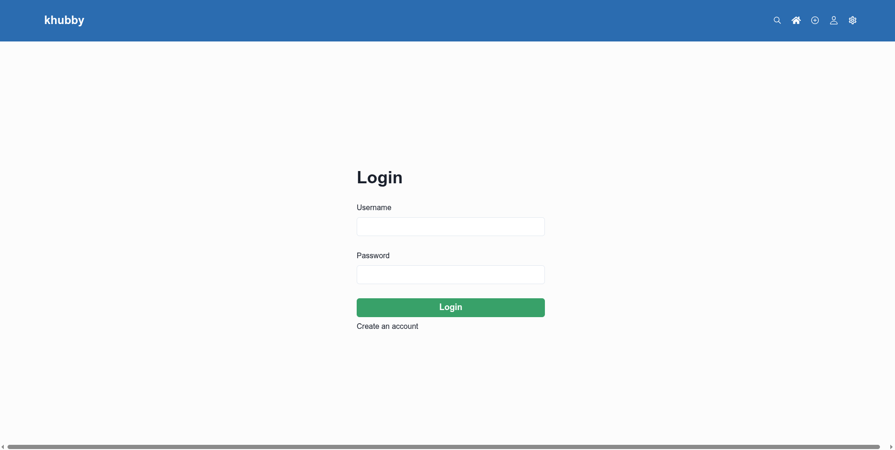
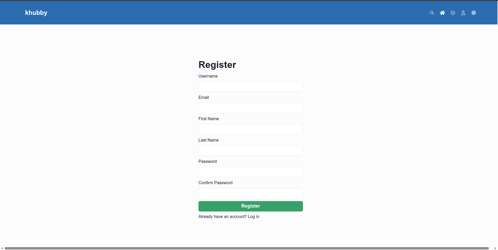
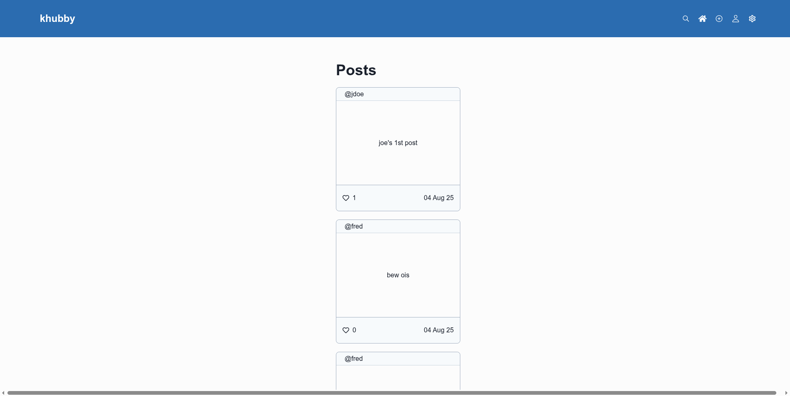
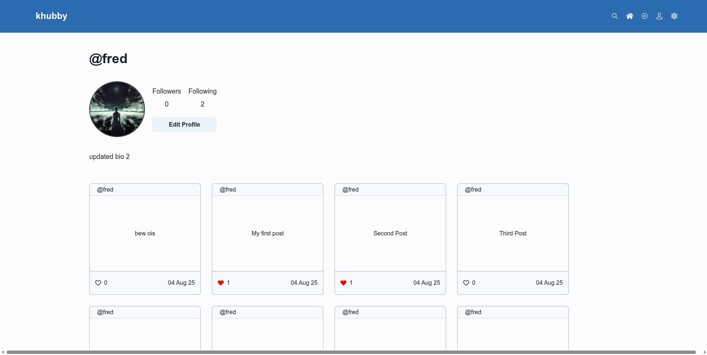
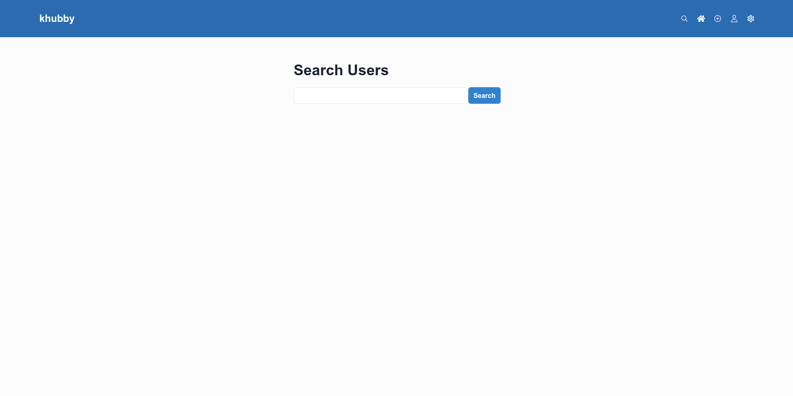
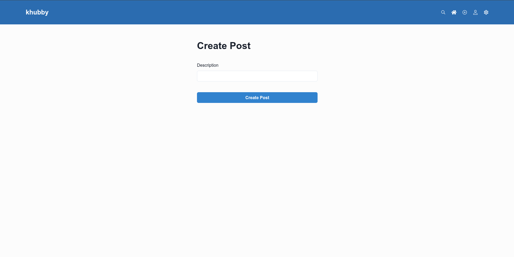
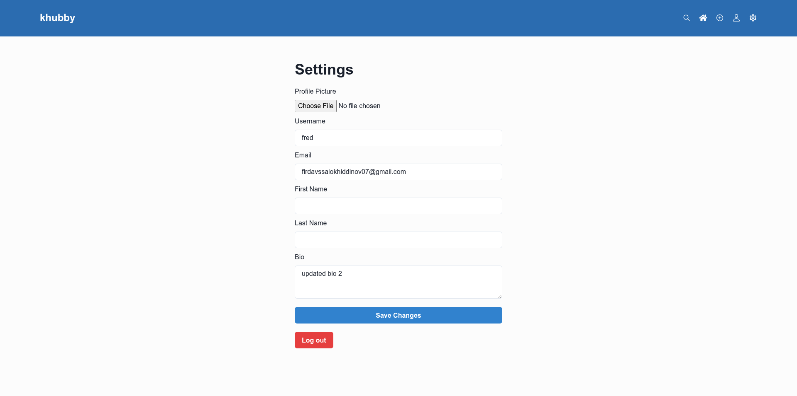
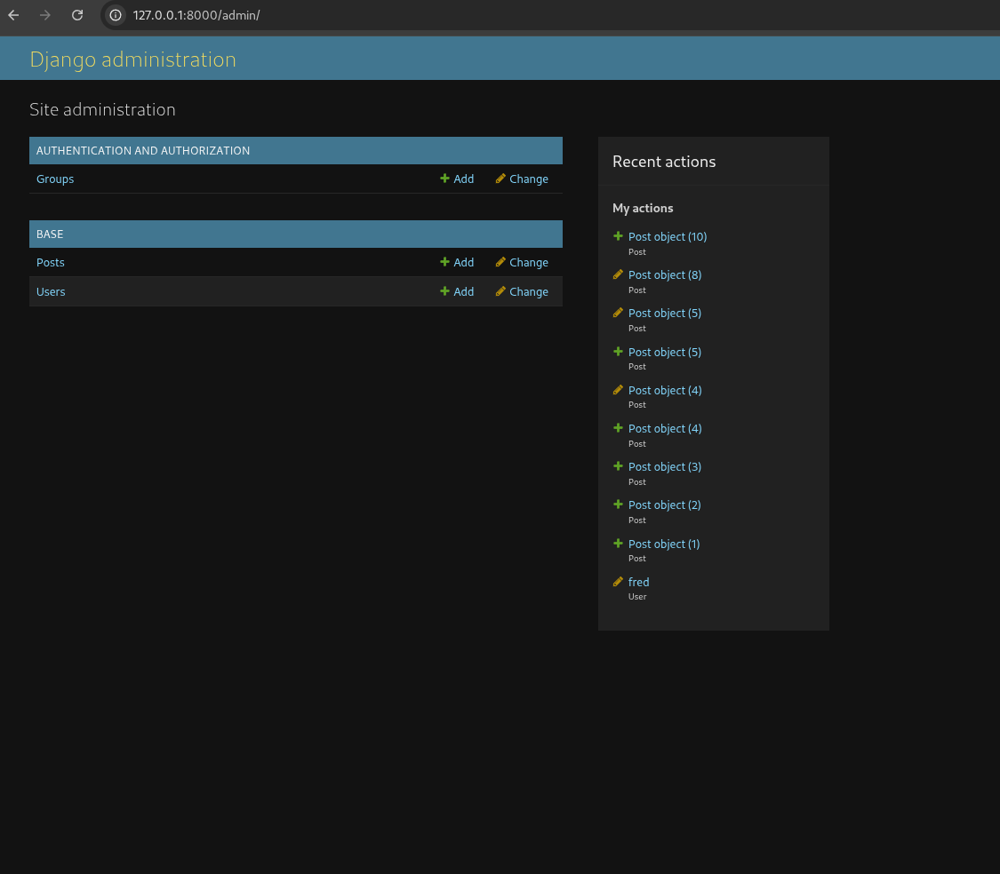

# Social Media App

A full-stack social media project with a Django REST backend and a React + Vite frontend. Users can register, log in, publish short posts, like content, follow other users, search profiles, and update their account details.

## Overview

This repository is split into two main apps:

- `backend/` contains the Django API, authentication logic, media handling, and admin panel.
- `frontend/` contains the React user interface built with Chakra UI and React Router.

Authentication is handled with JWT tokens stored in HTTP-only cookies, and the frontend talks to the backend through the API under `/api/`.

## Features

- User registration and login
- Cookie-based JWT authentication
- Public user profiles
- Follow and unfollow users
- Create text posts
- Like and unlike posts
- Feed with paginated posts
- Search users by username
- Update profile details and avatar
- Django admin for backend management

## Tech Stack

- Backend: Django, Django REST Framework, Simple JWT, SQLite
- Frontend: React, Vite, Chakra UI, React Router, Axios
- Media: Django `ImageField` uploads stored in `backend/media/`

## Screenshots

### Login



### Register



### Home / Feed



### Profile



### Search



### Create Post



### Settings



### Django Admin



## What Users Can Do On Each Page

### Login

Users can:

- sign in with a username and password
- start an authenticated session
- move to the registration page if they do not have an account

### Register

Users can:

- create a new account
- provide username, email, first name, last name, and password
- return to the login page after successful registration

### Home / Feed

Users can:

- browse the global post feed
- load more posts with pagination
- like and unlike posts
- view the username and publish date for each post

### Profile

Users can:

- view a user's profile image, bio, follower count, and following count
- browse that user's posts
- follow or unfollow other users

Notes:

- when visiting their own profile, users see an `Edit Profile` button
- actual profile editing is currently handled on the Settings page

### Search

Users can:

- search users by username
- view basic profile cards in the results
- open a user profile by clicking a result

### Create Post

Users can:

- write a text post
- submit the post and return to the feed

### Settings

Users can:

- upload a profile picture
- update username, email, first name, last name, and bio
- save changes
- log out

### Django Admin

Admins can:

- inspect and manage users and posts from Django admin
- review uploaded media and application data directly from the backend

## Project Structure

```text
social_media_app/
├── backend/
│   ├── base/
│   ├── config/
│   ├── media/
│   ├── manage.py
│   └── requirements.txt
├── frontend/
│   ├── src/
│   ├── package.json
│   └── vite.config.js
├── readme_imgs/
└── README.md
```

## Setup and Run

### Prerequisites

Install these first:

- Python 3.11 or newer
- Node.js 18 or newer
- npm

### 1. Clone the project

```bash
git clone <your-repository-url>
cd social_media_app
```

### 2. Set up the backend

Move into the backend folder:

```bash
cd backend
```

Create and activate a virtual environment:

```bash
python3 -m venv .venv
source .venv/bin/activate
```

On Windows PowerShell:

```powershell
py -m venv .venv
.venv\Scripts\Activate.ps1
```

Install backend dependencies:

```bash
pip install -r requirements.txt
```

Apply migrations:

```bash
python manage.py migrate
```

Optional: create an admin user for Django admin:

```bash
python manage.py createsuperuser
```

Start the backend server:

```bash
python manage.py runserver
```

The backend will be available at:

- API base URL: `http://127.0.0.1:8000/api/`
- Django admin: `http://127.0.0.1:8000/admin/`

### 3. Set up the frontend

Open a second terminal and move into the frontend folder:

```bash
cd frontend
```

Install dependencies:

```bash
npm install
```

Start the development server:

```bash
npm run dev
```

The frontend will usually run at:

- `http://127.0.0.1:5173/`

### 4. Confirm frontend/backend connectivity

This project already points the frontend API client at:

- `http://127.0.0.1:8000/api`

That value currently lives in `frontend/src/constants/constants.js`.

The backend CORS settings already allow the default Vite dev URL:

- `http://localhost:5173`

If you change ports or hosts, update both the frontend API base URL and the backend CORS settings.

## Development Notes

- The backend uses SQLite by default.
- Uploaded profile images are stored under `backend/media/profile_image/`.
- The frontend uses protected routes, so most pages require login before access.
- JWT access and refresh tokens are stored in cookies, not local storage.
- Basic user details are also cached in local storage for UI state.

## Testing

### Automated backend tests

Run the backend test suite from the `backend/` folder:

```bash
source .venv/bin/activate
python manage.py test
```

The current backend tests cover:

- user registration
- login and JWT cookie creation
- cookie-based authenticated access
- follow and unfollow behavior
- post creation and feed retrieval
- like and unlike behavior
- user search
- profile updates

### Manual app testing

After both servers are running, test the app like this:

1. Open the frontend in your browser.
2. Register a new account.
3. Log in with the new account.
4. Create a post from the Create Post page.
5. Return to the Home page and confirm the post appears in the feed.
6. Open your profile and confirm your post appears there.
7. Create a second user account in another browser or private window.
8. Use Search to find that second user.
9. Open the user profile and test follow/unfollow.
10. Like and unlike a post from the feed or profile page.
11. Open Settings and update your profile details or avatar.
12. Visit Django admin and confirm users and posts are visible there if you created a superuser.

### Verification commands

Useful commands for checking the project:

```bash
cd backend
python manage.py check
python manage.py test
```

```bash
cd frontend
npm run dev
```
